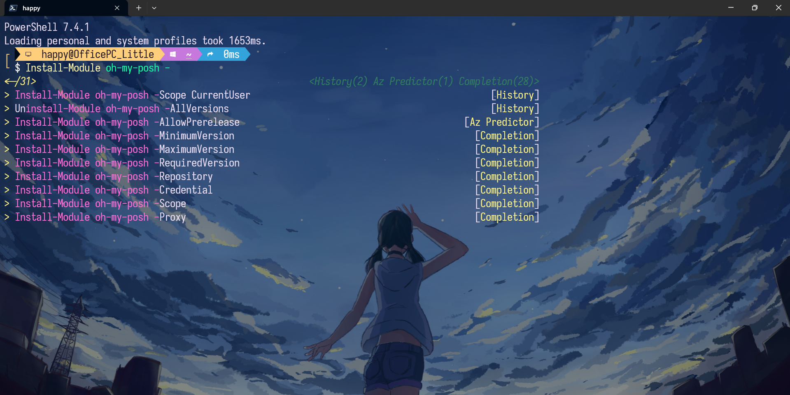

# Complete Guide to Configuring Machine Learning IntelliSense in PowerShell

[简体中文](https://github.com/happylittle2010/PowerShell-ML-IntelliSense-Guide-zh) | [English](https://github.com/happylittle2010/PowerShell-ML-IntelliSense-Guide)

The PSReadLine plugin in Powershell provides intelligent prompt features based on historical records. Additionally, there are several plugins that provide machine learning-based intelligent prompts. Once all configurations are completed, you can have an IDE-like intelligent prompt experience in Powershell.

(The effect in the picture comes from intelligent prompts of historical records and plugins)

## Install Windows Terminal (optional)
It is recommended to install Windows Terminal as the default terminal:
[Install and get started setting up Windows Terminal](https://learn.microsoft.com/en-us/windows/terminal/install)

## Install PowerShell 7 using Winget
Search for the latest version of PowerShell:
```PowerShell
winget search Microsoft.PowerShell
```
Install PowerShell using the id parameter:
```PowerShell
winget install --id Microsoft.Powershell --source winget
```

## Install PSReadLine
Install PSReadLine using PowerShellGet:
```PowerShell
Install-Module -Name PSReadLine
```

## Install machine learning-based IntelliSense plugins
Install the Az.Accounts plugin (a prerequisite plugin for the IntelliSense plugin Az.Tools.Predictor):
```PowerShell
Install-module -name Az.Accounts -Force
```

Install the Az.Tools.Predictor plugin:
```PowerShell
Install-module -name Az.Tools.Predictor -Force
```

Enable the Az.Tools.Predictor plugin:
```PowerShell
Enable-AzPredictor -AllSession
```

Install the CompletionPredictor plugin:
```PowerShell
Install-Module -Name CompletionPredictor -Repository PSGallery
```

## Configure PowerShell
Open the PowerShell configuration file with Notepad:
```PowerShell
notepad $PROFILE
```

If the above command fails, create a configuration file first:
```PowerShell
New-Item -Path $PROFILE -Type File -Force
```

In the opened configuration file, paste the following configuration content:
```ps1
# Import intelligent prompt modules
Import-Module PSReadLine
Import-Module Az.Tools.Predictor
Import-Module -Name CompletionPredictor

# Set IntelliSense prediction source and history records and plugins
Set-PSReadLineOption -PredictionSource HistoryAndPlugin
```

Save the configuration file and reload (or restart PowerShell):
```PowerShell
. $PROFILE
```

Now, PowerShell has machine learning-based intelligent prompts. There are two ways to display intelligent prompts, one is inline display, press the `right arrow` to select the predicted result when entering. The other is a list prediction view, press the `up/down arrow key` to select the predicted result when entering.

Press `F2` to switch between `inline prediction` and `list prediction` modes. If you want PowerShell to automatically switch to `list prediction` mode every time it starts, add this sentence to the configuration file:
```ps1
Set-PSReadLineOption -PredictionViewStyle ListView
```

## Other prompt and completion plugins
The oh-my-posh plugin can provide PowerShell beautification, git information display, and the posh-git plugin can provide intelligent completion of git commands. For example, after installing the posh-git plugin, type `git ch` , then press the `Tab` key, it will automatically complete as `git checkout` , continue to press the `Tab` key, it will cycle between commands such as `git cherry` and `git cherry-pick`.

### oh-my-posh plugin installation and configuration
Install via winget:
```PowerShell
winget install JanDeDobbeleer.OhMyPosh -s winget
```

 > When using the oh-my-posh plugin, you need to use Nerd Fonts, otherwise, garbled text will appear. The [Nerd Fonts](https://www.nerdfonts.com/font-downloads) website has collected some commonly used Nerd fonts.

You can call up all oh-my-posh themes with this command:
```PowerShell
Get-PoshThemes
```

After selecting your favorite theme (for example, choose the markbull theme), go back to the PowerShell configuration file and add the following content:
```ps1
# Configure oh-my-posh as an antivirus software exception and select the markbull theme as the default theme
oh-my-posh init pwsh --config "$env:POSH_THEMES_PATH/markbull.omp.json" | Invoke-Expression
```

After the configuration is completed, save the configuration file and reload (or restart PowerShell):
```PowerShell
. $PROFILE
```

### posh-git plugin installation and configuration
```PowerShell
Install-Module posh-git -Scope CurrentUser -Force
```
After installation, add the following content to the PowerShell configuration file:
```
# Import intelligent prompt modules
Import-Module posh-git
```

## Common problems

### Why is there garbled text in the terminal of the VSCode/Jetbrains editor
Please change the font of the corresponding editor terminal to Nerd Font.

## Related links
[Using Predictors in PSReadLine](https://learn.microsoft.com/en-us/powershell/scripting/learn/shell/using-predictors?view=powershell-7.4)

[Announcing General Availability of Az.Tools.Predictor](https://techcommunity.microsoft.com/t5/azure-tools-blog/announcing-general-availability-of-az-tools-predictor/ba-p/3297956)

[CompletionPredictor](https://github.com/PowerShell/CompletionPredictor)

[Oh My Posh](https://ohmyposh.dev/)

[posh-git](https://github.com/dahlbyk/posh-git)